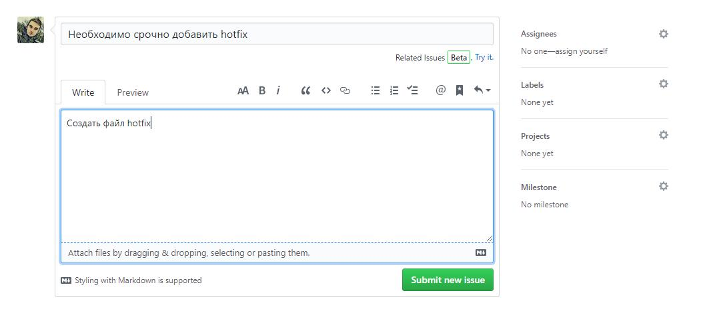

# 3-ivt-17-t4
Тема 4. 3ИВТ/17

# Инвариантная СР (ИСР)

### 4.1. Изучив конкретную систему управления проектами, использовав одну из стратегий ветвления (branching strategies) на основе системы версий Git реализовать добавление функции (рефакторинга существующего кода) в существующем программном проекте, предварительно создать запрос на добавление функционала (issue). 

Создаем ветки на основе git flow  
  
Добавляем Issue  
  
Добавляем файл    
  
Закрываем issue   
  

### 4.2. Реализация конкретного проекта с нуля (проект согласуется с преподавателем): написание фрагмента технического задания, создание макетов продукта (мобильной, настольной версий), реализация макетов с использованием одного из клиентских фреймворков, создание схемы функционирования продукта, вариантов его использования конечным пользователем, создание плана юзабилити-тестирования продукта, выбор методологии и модели разработки, организация учета и управления задачами и временем (создание диаграммы Гантта). Оформление отчета по результатам работы и презентации с основными результатами. Публичное выступление.

Отчет представлен ввиде курсовой работы: [https://docs.google.com/document/d/1MUybemb8ivXgVzcjVOHK0MzUIxRiOYtdqdJZUlc_FpA/edit](https://docs.google.com/document/d/1MUybemb8ivXgVzcjVOHK0MzUIxRiOYtdqdJZUlc_FpA/edit)

# Вариативная СР (ВСР)

### 4.1. Используя стратегию ветвления "стабильная ветвь" и функционал сервиса GitHub реализовать слияние двух "веток" разработки (главной ветки - протестированный и отлаженный функционал и "ветки" новой функции/исправленной ошибки). 

Создаем ветку и переходим на нее  
  
Создаем файл с фиксами  
  
Переходим в основную ветвь и мерджим ветки 
  
Пушим изменения   
  
Проверяем удаленный сервер  
  
